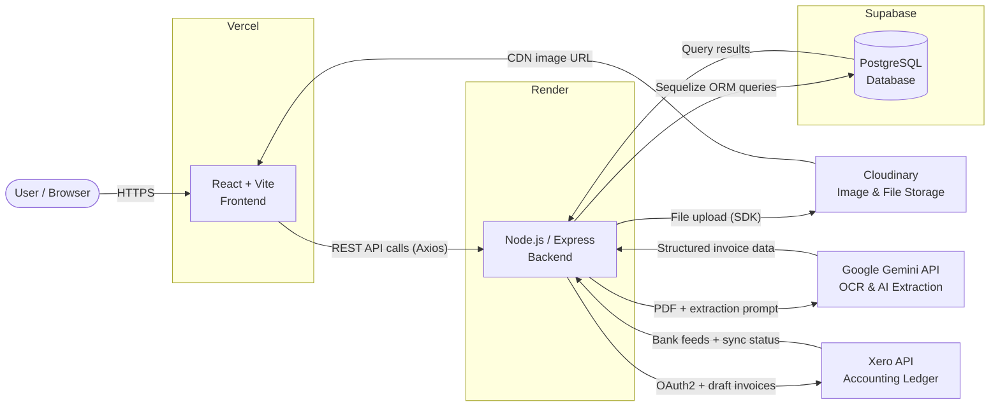

```mermaid
graph LR
    User([User / Browser])

    subgraph Vercel
        FE["React + Vite\nFrontend"]
    end

    subgraph Render
        BE["Node.js / Express\nBackend"]
    end

    subgraph Supabase
        DB[("PostgreSQL\nDatabase")]
    end

    Cloudinary["Cloudinary\nImage & File Storage"]
    Gemini["Google Gemini API\nOCR & AI Extraction"]
    Xero["Xero API\nAccounting Ledger"]

    User -->|HTTPS| FE
    FE -->|"REST API calls (Axios)"| BE
    BE -->|"Sequelize ORM queries"| DB
    DB -->|"Query results"| BE
    BE -->|"File upload (SDK)"| Cloudinary
    Cloudinary -->|"CDN image URL"| FE
    BE -->|"PDF + extraction prompt"| Gemini
    Gemini -->|"Structured invoice data"| BE
    BE -->|"OAuth2 + draft invoices"| Xero
    Xero -->|"Bank feeds + sync status"| BE
```
