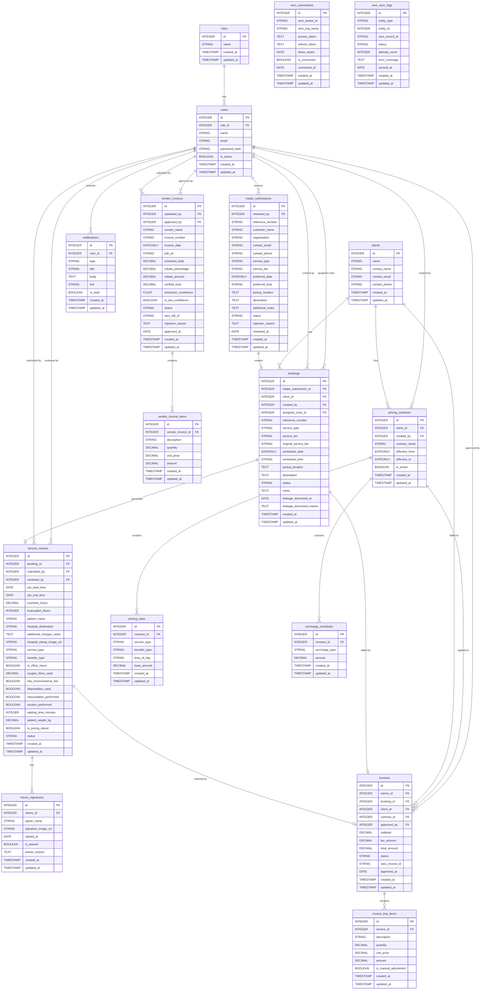

```mermaid
erDiagram
    roles {
        INTEGER id PK
        STRING name
        TIMESTAMP created_at
        TIMESTAMP updated_at
    }

    users {
        INTEGER id PK
        INTEGER role_id FK
        STRING name
        STRING email
        STRING password_hash
        BOOLEAN is_active
        TIMESTAMP created_at
        TIMESTAMP updated_at
    }

    clients {
        INTEGER id PK
        STRING name
        STRING contact_name
        STRING contact_email
        STRING contact_phone
        TIMESTAMP created_at
        TIMESTAMP updated_at
    }

    intake_submissions {
        INTEGER id PK
        INTEGER reviewed_by FK
        STRING reference_number
        STRING customer_name
        STRING organisation
        STRING contact_email
        STRING contact_phone
        STRING service_type
        STRING service_tier
        DATEONLY preferred_date
        STRING preferred_time
        TEXT pickup_location
        TEXT destination
        TEXT additional_notes
        STRING status
        TEXT rejection_reason
        DATE reviewed_at
        TIMESTAMP created_at
        TIMESTAMP updated_at
    }

    bookings {
        INTEGER id PK
        INTEGER intake_submission_id FK
        INTEGER client_id FK
        INTEGER created_by FK
        INTEGER assigned_crew_id FK
        STRING reference_number
        STRING service_type
        STRING service_tier
        STRING original_service_tier
        DATEONLY scheduled_date
        STRING scheduled_time
        TEXT pickup_location
        TEXT destination
        STRING status
        TEXT notes
        DATE leakage_dismissed_at
        TEXT leakage_dismissed_reason
        TIMESTAMP created_at
        TIMESTAMP updated_at
    }

    service_memos {
        INTEGER id PK
        INTEGER booking_id FK
        INTEGER submitted_by FK
        INTEGER reviewed_by FK
        DATE job_start_time
        DATE job_end_time
        DECIMAL overtime_hours
        INTEGER evacuation_floors
        STRING patient_name
        STRING hospital_destination
        TEXT additional_charges_notes
        STRING hospital_stamp_image_url
        STRING service_type
        STRING transfer_type
        BOOLEAN is_office_hours
        DECIMAL oxygen_litres_used
        BOOLEAN has_inconvenience_fee
        BOOLEAN disposables_used
        BOOLEAN resuscitation_performed
        BOOLEAN suction_performed
        INTEGER waiting_time_minutes
        DECIMAL patient_weight_kg
        BOOLEAN is_jurong_island
        STRING status
        TIMESTAMP created_at
        TIMESTAMP updated_at
    }

    memo_signatures {
        INTEGER id PK
        INTEGER memo_id FK
        STRING signer_name
        STRING signature_image_url
        DATE signed_at
        BOOLEAN is_waived
        TEXT waiver_reason
        TIMESTAMP created_at
        TIMESTAMP updated_at
    }

    pricing_contracts {
        INTEGER id PK
        INTEGER client_id FK
        INTEGER created_by FK
        STRING contract_name
        DATEONLY effective_from
        DATEONLY effective_to
        BOOLEAN is_active
        TIMESTAMP created_at
        TIMESTAMP updated_at
    }

    pricing_rates {
        INTEGER id PK
        INTEGER contract_id FK
        STRING service_type
        STRING transfer_type
        STRING time_of_day
        DECIMAL base_amount
        TIMESTAMP created_at
        TIMESTAMP updated_at
    }

    surcharge_schedules {
        INTEGER id PK
        INTEGER contract_id FK
        STRING surcharge_type
        DECIMAL amount
        TIMESTAMP created_at
        TIMESTAMP updated_at
    }

    invoices {
        INTEGER id PK
        INTEGER memo_id FK
        INTEGER booking_id FK
        INTEGER client_id FK
        INTEGER contract_id FK
        INTEGER approved_by FK
        DECIMAL subtotal
        DECIMAL tax_amount
        DECIMAL total_amount
        STRING status
        STRING xero_invoice_id
        DATE approved_at
        TIMESTAMP created_at
        TIMESTAMP updated_at
    }

    invoice_line_items {
        INTEGER id PK
        INTEGER invoice_id FK
        STRING description
        DECIMAL quantity
        DECIMAL unit_price
        DECIMAL amount
        BOOLEAN is_manual_adjustment
        TIMESTAMP created_at
        TIMESTAMP updated_at
    }

    notifications {
        INTEGER id PK
        INTEGER user_id FK
        STRING type
        STRING title
        TEXT body
        STRING link
        BOOLEAN is_read
        TIMESTAMP created_at
        TIMESTAMP updated_at
    }

    xero_connections {
        INTEGER id PK
        STRING xero_tenant_id
        STRING xero_org_name
        TEXT access_token
        TEXT refresh_token
        DATE token_expiry
        BOOLEAN is_connected
        DATE connected_at
        TIMESTAMP created_at
        TIMESTAMP updated_at
    }

    vendor_invoices {
        INTEGER id PK
        INTEGER uploaded_by FK
        INTEGER approved_by FK
        STRING vendor_name
        STRING invoice_number
        DATEONLY invoice_date
        STRING pdf_url
        DECIMAL extracted_total
        DECIMAL rebate_percentage
        DECIMAL rebate_amount
        DECIMAL verified_total
        FLOAT extraction_confidence
        BOOLEAN is_low_confidence
        STRING status
        STRING xero_bill_id
        TEXT rejection_reason
        DATE approved_at
        TIMESTAMP created_at
        TIMESTAMP updated_at
    }

    vendor_invoice_items {
        INTEGER id PK
        INTEGER vendor_invoice_id FK
        STRING description
        DECIMAL quantity
        DECIMAL unit_price
        DECIMAL amount
        TIMESTAMP created_at
        TIMESTAMP updated_at
    }

    xero_sync_logs {
        INTEGER id PK
        STRING entity_type
        INTEGER entity_id
        STRING xero_record_id
        STRING status
        INTEGER attempt_count
        TEXT error_message
        DATE synced_at
        TIMESTAMP created_at
        TIMESTAMP updated_at
    }

    roles ||--o{ users : "has"
    users ||--o{ intake_submissions : "reviews"
    intake_submissions ||--o| bookings : "creates"
    clients ||--o{ bookings : "has"
    users ||--o{ bookings : "created by"
    users ||--o{ bookings : "assigned crew"
    bookings ||--o| service_memos : "generates"
    users ||--o{ service_memos : "submitted by"
    users ||--o{ service_memos : "reviewed by"
    service_memos ||--o{ memo_signatures : "has"
    clients ||--o{ pricing_contracts : "has"
    users ||--o{ pricing_contracts : "created by"
    pricing_contracts ||--o{ pricing_rates : "contains"
    pricing_contracts ||--o{ surcharge_schedules : "contains"
    service_memos ||--o| invoices : "matched to"
    bookings ||--o| invoices : "billed as"
    clients ||--o{ invoices : "billed to"
    pricing_contracts ||--o{ invoices : "applied to"
    users ||--o{ invoices : "approved by"
    invoices ||--o{ invoice_line_items : "contains"
    users ||--o{ notifications : "receives"
    users ||--o{ vendor_invoices : "uploaded by"
    users ||--o{ vendor_invoices : "approved by"
    vendor_invoices ||--o{ vendor_invoice_items : "contains"
```
